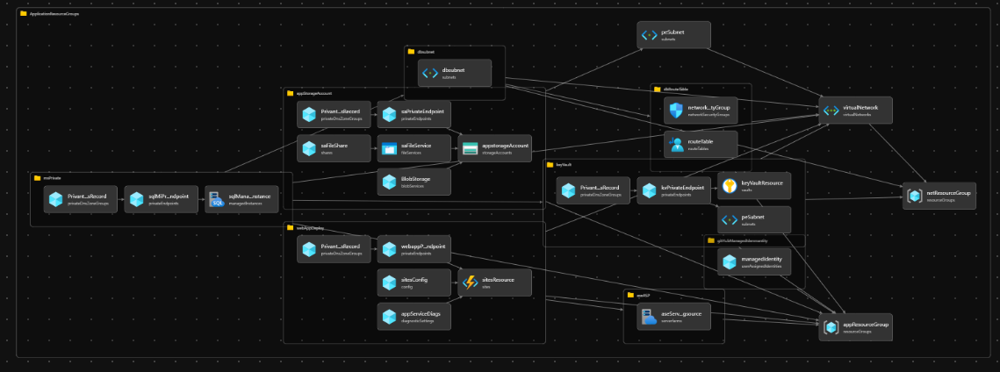

# Deploying and Redeploying SQL Managed Instances in Azure Using Bicep

## Introduction
Deploying and redeploying SQL Managed Instances in Azure through Bicep posed significant challenges. Initially, I inspected the deployment in the portal, but Azure's management of NSG and routing obscured essential details for SQL MI, even after decompiling the portal deployment.

## Microsoft Docs Module Issues
Efforts to utilize the Microsoft Docs module encountered errors due to its lack of routes for OneDSCollector, venetlcal, mi storage, and NSG for health probe, Azure AD out, mi one dsc out, mi-strg-p-out, among others.

## NSG Naming and Parameterization
NSGs were primarily generated from the IP subnet prefix used for SQL MI, with periods replaced by dashes and address space interpolation. For example, 192.168.2.0/24 became 192_168_2_0_24. Combining this with the NSG name prefix and suffix resulted in names like 'Microsoft.Sql-managedInstances_UseOnly_mi-strg-p-out-192_168_2_0_24--v11.' Similar naming patterns were applied to other NSGs requiring IP interpolation. Parameterizing the NSG name enabled the creation of repeatable NSGs and route tables, ensuring compatibility with auto-generated names and making the module idempotent and redeployable.

## Module Redeployment
Redeploying the module after creating databases, backups, web app configurations, key secret updates revealed that redeployment did not impact the data plane changes. However, altering authentication to AAD from the portal affected DB authentication, constituting a management change. It is recommended to incorporate AAD authentication Bicep code if access to the tenant is available, although it's currently absent in my code.

## Code Structure
The authored code includes a main module creating a resource group with `appResourceGroup.bicep`. This resource group module serves as a parent resource for `webAppModule.bicep`, `gitHubManagedIdentity.bicep`, `appServicePlan.bicep`, all located in the module folder. Additionally, there's an `SQLMI` folder housing `dbrouteTable`, `DBsubnet`, `DnsZone`, and `SQMI Bicep` files.

## Dependencies
While most modules depend on the newly created resource group, additional dependencies exist for existing resources, such as VNET in an existing network resource group, an existing Private DNS resource, and subnet resources for private endpoint and link deployment. Hard-coded values for existing resources are redacted in the `param.json` parameter file, allowing for customization based on specific requirements.

## NSG Names for SQL MI
The following NSG names were created for SQL MI:

- 'Microsoft.Sql-managedInstances_UseOnly_mi-optional-azure-out-${nsgSuffix}'
- 'Microsoft.Sql-managedInstances_UseOnly_mi-strg-s-out-${nsgSuffix}-v11'
- 'Microsoft.Sql-managedInstances_UseOnly_mi-strg-p-out-${nsgSuffix}-v11'
- 'Microsoft.Sql-managedInstances_UseOnly_mi-internal-out-${nsgSuffix}-v11'
- 'Microsoft.Sql-managedInstances_UseOnly_mi-onedsc-out-${nsgSuffix}-v11'
- 'Microsoft.Sql-managedInstances_UseOnly_mi-aad-out-${nsgSuffix}-v11'
- 'Microsoft.Sql-managedInstances_UseOnly_mi-internal-in-${nsgSuffix}-v11'
- 'Microsoft.Sql-managedInstances_UseOnly_mi-healthprobe-in-${nsgSuffix}-v11'

In addition, the MS Bicep code lists NSGs such as 'allow_tds_inbound', 'allow_redirect_inbound,' and specifies the denial of all other inbound and outbound traffic.

## Route Table Names for SQL MI
Route table names for SQL MI include:

- 'Microsoft.Sql-managedInstances_UseOnly_optional-AzureCloud.westus'
- 'Microsoft.Sql-managedInstances_UseOnly_optional-AzureCloud.${location}'
- 'Microsoft.Sql-managedInstances_UseOnly_mi-Storage.${pairedRegion}'
- 'Microsoft.Sql-managedInstances_UseOnly_mi-Storage.${location}'
- 'Microsoft.Sql-managedInstances_UseOnly_mi-OneDsCollector'
- 'Microsoft.Sql-managedInstances_UseOnly_mi-AzureActiveDirectory'
- 'Microsoft.Sql-managedInstances_UseOnly_subnet-${nsgSuffix}-to-vnetlocal'

## Web module
For Web module creates ASP and deployes web module. There are few naming orchestration to replace and genereate ASP and web module by replaing new resource group name. It could be created with better orchestration for all resources once I moved naming convention to a separate module. Since, this is complete endtoend deployment for web, db and all dependencies location inside the same RG. I found usage of RG as source naming efficient and easier. However, there are existing network and PE resources which are using different RG and naming there for orchestrated accordingly to refer exisiting resources.

## GitHub Action Flow
In my GitHub Actions and pipeline job setup, I'm using Open ID connect credentials for passwordless federated access. These credentials grant contributor rights to the subscription for this specific GitHub organization and the main branch repository. To ensure security, I pass the Subscription name, TenantID, and Client ID as secrets, avoiding any exposure of this information in the code, deployment outputs, or public Git URL access.

Less sensitive information is passed as environment variables within the code, making it easy to change them from the GUI, especially for users who deploy the code but are not its authors.

I've organized my workflow into three main jobs:

Linting and Validation Jobs: These jobs run in parallel to assess the code's integrity.

Preview or What If Jobs: These jobs execute after the linting and validation jobs have completed successfully.

Deploy Jobs: These jobs rely on the output from the preview job to initiate the deployment of Azure resources.

Additionally, there is a "Smoke Test Job" that depends on the deployment job to finish before conducting tests on the web app.

Each of these jobs involves preflight validation, what-if analysis, and deployment steps, which typically include checking out the code, installing dependencies, and deploying the code.

GitHub Actions workflows consist of one or more jobs, and each job contains one or more steps. You can have multiple workflows, multiple jobs per workflow, and multiple steps per job. Triggers and events can be configured to automatically initiate workflows, or they can be triggered manually or based on code pushes.

Each job defines a runner, which is the execution environment for the job. Multiple jobs can run in parallel, but you can control their execution order using "needs" or conditional job dependencies.

The actual work within each step can involve running shell scripts or using predefined actions (scripts designed to perform specific tasks).

Code repository link -
pchettri3/web-sql-mi: none ASE web app with SQL MI (github.com)
